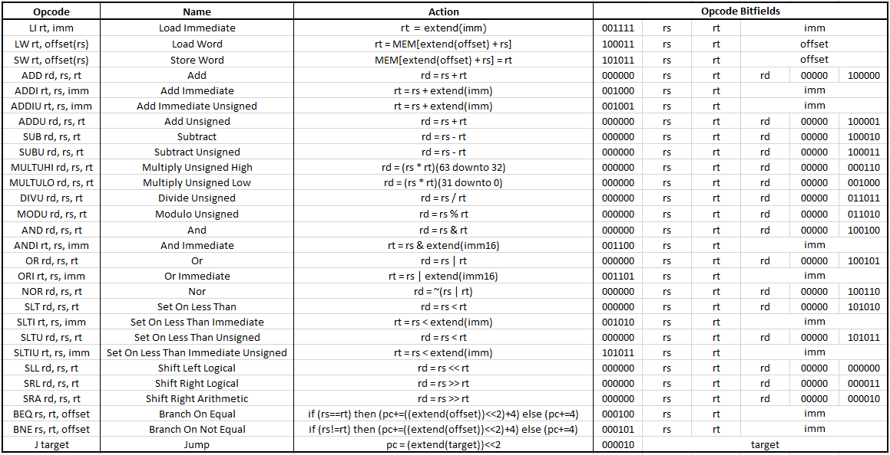
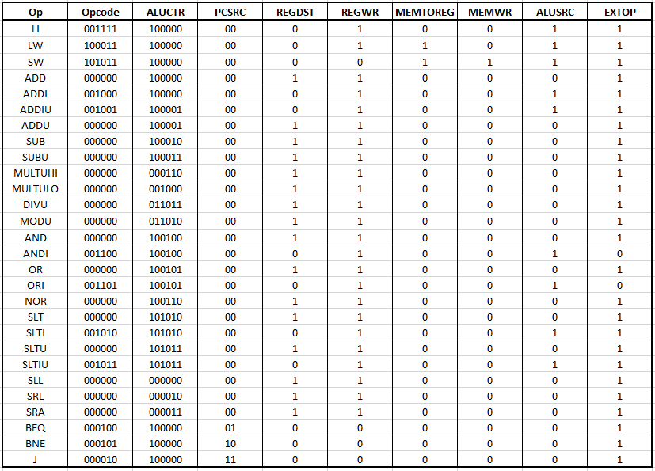

# Single Cycle CPU

The single cycle CPU is a circuit that implements the fetch decode execute cycle of a CPU using VHDL. The following figure shows all the MIPs instructions that were implemented. For each instruction, the usage, name, action, and bit fields are shown. The figure after that shows how the control signals for the CPU are changed based on the current running instructions. The figure after that shows the specific instructions that I will be running to showcase my CPU. It will read 6 numbers from data memory and sum them in a loop. At the end of the loop the sum is stored into data memory.

	
	Figure 1: Table of all implemented instructions.

  

	
	Figure 2: Table of control signals for all implemented instructions.

  

	
	Figure 3: MIPs code used to test the CPU.

  

## Block Diagrams

Figure 4: Block diagram for single cycle CPU.

Figure 5: Block diagram for controller.

Figure 6: Block diagram for NALU.

Figure 7: Block diagram for instruction memory.

Figure 8: Block diagram for data memory.

Figure 9: Block diagram for extender.

Figure 10: Block diagram for register file.

Figure 11: Block diagram for ALU.

## Simulations

Figure 12: The figure above is the entire execution and all iterations of the loop of the code that is being run. We can see that it takes 2075 ns to complete the execution.

Figure 13: The figure above shows the first loop of the code that is being run. We can see that right after the branch on not equal instruction is run, it will then execute the first instruction of the loop again which is the load word instruction.

Figure 14: In this interval CLK is on the rising edge and the program counter is 0x00000004 therefore the instruction register holds the instruction at address 0x00000004 of the instruction memory which is 0x3C100006. The instruction being performed here is LI(load immediate) with rs set to 00000, rt set to 10000, and imm set to 0x0006. According to the design ALUCTR should be 100000, PCSRC should be 00, REGDST should be 0, REGWR should be 1, MEMTOREG should be 0, MEMWR should be 0, ALUSRC should be 1, and EXTOP should be 1. Therefore 0x00000006 should be loaded into register 10000. This behavior can be seen in the waveform above.

Figure 15: In this interval CLK is on the rising edge and the program counter is 0x00000008 therefore the instruction register holds the instruction at address 0x00000008 of the instruction memory which is 0x8E320000. The instruction being performed here is LW(load word) with rs set to 10001, rt set to 10010, and offset set to 0x0000. According to the design ALUCTR should be 100000, PCSRC should be 00, REGDST should be 0, REGWR should be 1, MEMTOREG should be 1, MEMWR should be 0, ALUSRC should be 1, and EXTOP should be 1. Therefore the data at address 0x00000000 of the data memory is loaded into register 10010. This behavior can be seen in the waveform above.

Figure 16: In this interval CLK is on the rising edge and the program counter is 0x0000000C therefore the instruction register holds the instruction at address 0x0000000C of the instruction memory which is 0x0272A020. The instruction being performed here is ADD with rs set to 10011, rt set to 10010, rd set to 10100, and function set to 100000. According to the design ALUCTR should be 100000, PCSRC should be 00, REGDST should be 1, REGWR should be 1, MEMTOREG should be 0, MEMWR should be 0, ALUSRC should be 0, and EXTOP should be 1. Therefore the sum of registers 10011 and 10010 is stored into register 10100. This behavior can be seen in the waveform above.

Figure 17: In this interval CLK is on the rising edge and the program counter is 0x00000010 therefore the instruction register holds the instruction at address 0x00000010 of the instruction memory which is 0x02809820. The instruction being performed here is ADD with rs set to 10100, rt set to 00000, rd set to 10011, and function set to 100000. According to the design ALUCTR should be 100000, PCSRC should be 00, REGDST should be 1, REGWR should be 1, MEMTOREG should be 0, MEMWR should be 0, ALUSRC should be 0, and EXTOP should be 1. Therefore the sum of registers 10100 and 00000 is stored into register 10011. This behavior can be seen in the waveform above.

Figure 18: In this interval CLK is on the rising edge and the program counter is 0x00000014 therefore the instruction register holds the instruction at address 0x00000014 of the instruction memory which is 0x2214FFFF. The instruction being performed here is ADDI(add immediate) with rs set to 10000, rt set to 10100, and imm set to 0xFFFF. According to the design ALUCTR should be 100000, PCSRC should be 00, REGDST should be 0, REGWR should be 1, MEMTOREG should be 0, MEMWR should be 0, ALUSRC should be 1, and EXTOP should be 1. Therefore the sum of register 10000 and 0xFFFF is stored into register 10100. This behavior can be seen in the waveform above.

Figure 19: In this interval CLK is on the rising edge and the program counter is 0x00000018 therefore the instruction register holds the instruction at address 0x00000018 of the instruction memory which is 0x02808020. The instruction being performed here is ADD with rs set to 10100, rt set to 00000, rd set to 10000, and function set to 100000. According to the design ALUCTR should be 100000, PCSRC should be 00, REGDST should be 1, REGWR should be 1, MEMTOREG should be 0, MEMWR should be 0, ALUSRC should be 0, and EXTOP should be 1. Therefore the sum of registers 10100 and 00000 is stored into register 10000. This behavior can be seen in the waveform above.

Figure 20: In this interval CLK is on the rising edge and the program counter is 0x0000001C therefore the instruction register holds the instruction at address 0x0000001C of the instruction memory which is 0x22340001. The instruction being performed here is ADDI(add immediate) with rs set to 10001, rt set to 10100, and imm set to 0x0001. According to the design ALUCTR should be 100000, PCSRC should be 00, REGDST should be 0, REGWR should be 1, MEMTOREG should be 0, MEMWR should be 0, ALUSRC should be 1, and EXTOP should be 1. Therefore the sum of register 10001 and 0x0001 is stored into register 10100. This behavior can be seen in the waveform above.

Figure 21: In this interval CLK is on the rising edge and the program counter is 0x00000020 therefore the instruction register holds the instruction at address 0x00000020 of the instruction memory which is 0x02808820. The instruction being performed here is ADD with rs set to 10100, rt set to 00000, rd set to 10001, and function set to 100000. According to the design ALUCTR should be 100000, PCSRC should be 00, REGDST should be 1, REGWR should be 1, MEMTOREG should be 0, MEMWR should be 0, ALUSRC should be 0, and EXTOP should be 1. Therefore the sum of registers 10100 and 00000 is stored into register 10001. This behavior can be seen in the waveform above.

Figure 22: In this interval CLK is on the rising edge and the program counter is 0x00000024 therefore the instruction register holds the instruction at address 0x00000024 of the instruction memory which is 0x1410FFF8. The instruction being performed here is BNE(branch on not equal) with rs set to 00000, rt set to 10000, and imm set to 0xFFF8. According to the design ALUCTR should be 100000, PCSRC should be 10, REGDST should be 0, REGWR should be 0, MEMTOREG should be 0, MEMWR should be 0, ALUSRC should be 0, and EXTOP should be 1. Therefore NALU\_OUT should now be 0x00000008 because register 10000 does not equal 0. This behavior can be seen in the waveform above.

Figure 23: In this interval CLK is on the rising edge and the program counter is 0x00000028 therefore the instruction register holds the instruction at address 0x00000028 of the instruction memory which is 0xAC130007. The instruction being performed here is SW(store word) with rs set to 00000, rt set to 10011, and offset set to 0x0007. According to the design ALUCTR should be 100000, PCSRC should be 00, REGDST should be 0, REGWR should be 0, MEMTOREG should be 1, MEMWR should be 1, ALUSRC should be 1, and EXTOP should be 1. Therefore the data at address 0x00000007 of the data memory is updated with the number stored in register 10011. This behavior can be seen in the waveform above.